# Análisis del proyecto actual para `ashenox-spring-starter`

> Fecha de inspección: 2026-07-21. Alcance: `auth`, usuario, email, auditoría, `shared`, seguridad, configuración, logs, excepciones, tests y OpenAPI. El análisis es estático y de solo lectura. No se inspeccionaron valores de secretos del archivo `.env`.

## 1. Resumen ejecutivo

### Estado actual (hechos)

El backend es un monolito Spring Boot 4.0.4 / Java 17 organizado por capas técnicas (`Controller`, `Services`, `Model`, `Repository`, `Security`, `Utils`) y no por módulos. La autenticación usa access JWT firmado con HS256 enviado en `Authorization: Bearer`; el refresh token es un UUID persistido. El frontend guarda únicamente el access token en `localStorage`; no hay autenticación por cookies.

Existen login, rotación básica de refresh token, perfil (`GET /auth/profile`), recuperación/restablecimiento de contraseña y bootstrap de usuarios. No existen registro operativo, logout backend, verificación de email, bloqueo/habilitación, intentos fallidos, revocación global de sesiones ni auditoría persistida. Tampoco existe OpenAPI/Swagger.

### Fortalezas

- Spring Security autentica credenciales mediante `AuthenticationManager` y BCrypt.
- Los tokens de recuperación se generan con `SecureRandom` y se guardan como SHA-256, no en claro.
- La respuesta de `forgot-password` evita enumeración por su texto y por retornar 200 aunque el email no exista.
- Hay refresh token persistido y rotación en el endpoint.
- `EntidadAuditable` aporta timestamps automáticos.
- `RequestLoggingFilter` genera `requestId` mediante MDC y Logback separa logs generales, de seguridad y operaciones.
- Hay pruebas unitarias e integración útiles para login, JWT y password reset; los reportes Surefire presentes registran cero fallos.

### Principales problemas y riesgos

- `SecurityConfig` desactiva CSRF, aunque hoy no usa cookies. Si el starter migra tokens a cookies, copiar esta decisión sería inseguro.
- El access y refresh token se devuelven en JSON; React guarda el access token en `localStorage`, ampliando el impacto de XSS. El refresh token ni siquiera se usa en el frontend inspeccionado.
- `AuthController.refreshToken()` registra los primeros 10 caracteres del refresh token. `resetPassword()` registra prefijos del token de recuperación. Son secretos y no deben aparecer en logs.
- No hay logout backend. Cambiar la contraseña no revoca refresh tokens ni access JWT ya emitidos.
- El refresh token se guarda en claro, no tiene restricción única explícita y `RefreshToken` usa el nombre de tabla problemático `"Refresh Token"`.
- `DataInit.crearSuperAdminSiCorresponde()` crea `Role.ADMIN`, no `Role.SUPERADMINISTRADOR`.
- Las anotaciones usan nombres incompatibles: existen `SUPERADMINISTRADOR` y referencias a `SUPERADMIN`; esto puede negar accesos esperados.
- `UserDTO.fromUser()` no asigna `email`, aun cuando lo declara; `username` es en realidad el email.
- Email no se normaliza consistentemente y las búsquedas mezclan sensibilidad a mayúsculas.
- `PasswordResetServiceImpl.resetPassword()` carece de transacción: guardar usuario y marcar token usado no es atómico.
- `LoggingAspect` apunta a `com.ecommerce.template...`, por lo que sus pointcuts no alcanzan `com.example.rifa`.
- `EmailServiceImple` mezcla infraestructura SMTP/Thymeleaf con muchos casos de negocio de la rifa y absorbe excepciones; además no se encontró `@EnableAsync`, por lo que `@Async` requiere verificación operativa.
- `GlobalExceptionHandler` y `JwtRequestFilter` producen formatos de error distintos; el fallback usa `printStackTrace()`.
- No hay migraciones gestionadas; `spring.jpa.hibernate.ddl-auto=update` gobierna producción.
- `AppProperties` mezcla seguridad, bootstrap y datos propios de rifa/Mercado Pago; varias propiedades de email quedan fuera de esa clase y se consumen por `@Value`.

### Potencial de reutilización

Es medio: los conceptos y varias pruebas son aprovechables, pero extraer clases literalmente consolidaría defectos de seguridad y límites difusos. La opción recomendada es crear el starter desde cero usando este proyecto como referencia conductual, adaptando `EntidadAuditable`, DTO/validaciones simples, el esquema de recuperación de contraseña, el filtro MDC y parte de las pruebas; reescribir seguridad de tokens, bootstrap, email y errores.

## 2. Árbol de paquetes relevante

```text
com.example.rifa
├── Controller
│   └── AuthController
├── Model
│   ├── User
│   ├── AbstracClass/EntidadAuditable
│   ├── Auth
│   │   ├── AuthResponse
│   │   ├── LoginRequest
│   │   ├── RegisterRequest
│   │   ├── RefreshToken
│   │   ├── TokenRefreshRequest / TokenRefreshResponse
│   │   └── PasswordResetToken
│   ├── DTO
│   │   ├── UserDTO / SeedUserDto
│   │   └── Security/ForgotPasswordRequest / ResetPasswordRequest
│   └── Enum/Role / Permissions
├── Repository
│   ├── UserRepository
│   ├── Auth/RefreshTokenRepository
│   └── Email/PasswordResetTokenRepository
├── Security
│   ├── SecurityConfig / FilterConfig
│   ├── JWTUtil / JwtRequestFilter
│   └── PasswordEncoder
├── Services
│   ├── Interface/Auth/UserService / PasswordResetService
│   ├── Impl/Auth/AuthService / UserServiceImpl
│   │             RefreshTokenService / PasswordResetServiceImpl
│   ├── Interface/Email/EmailService / ComprobanteLinkService
│   ├── Impl/Email/EmailServiceImple / ComprobanteLinkServiceImpl
│   └── Impl/Logger/RequestLoggingFilter / LoggingAspect
├── Exception
│   ├── GlobalExceptionHandler / BusinessException / ResourceNotFoundException
│   ├── DTO/ErrorResponse
│   └── JWT/*
└── Utils
    ├── AppProperties / DataInit / EmailUtils
    └── utilidades específicas de rifa
```

No existe paquete de auditoría persistida ni configuración OpenAPI.

## 3. Inventario de clases

Categorías: **A** casi reusable; **B** reusable con adaptación; **C** específica de rifa; **D** mixta; **E** reescribir/reemplazar; **F** investigar.

| Clase | Paquete actual | Responsabilidad | Categoría | Dependencia con rifa | Acción sugerida |
|---|---|---|---|---|---|
| `User` | `Model` | Entidad y `UserDetails` | B | Ninguna de datos; nombre/rol rígidos | Adaptar/separar modelo de detalles de seguridad |
| `Role` | `Model.Enum` | Roles y permisos estáticos | B | Nombres administrativos actuales | Adaptar |
| `Permissions` | `Model.Enum` | CRUD genérico | E | Semántica demasiado genérica | Reescribir |
| `UserRepository` | `Repository` | Persistencia/búsquedas de usuario | B | Ninguna | Adaptar y eliminar métodos incoherentes |
| `UserService` | `Services.Interface.Auth` | CRUD/búsqueda de usuarios | D | Mezcla usuario con contrato de auth | Dividir |
| `UserServiceImpl` | `Services.Impl.Auth` | CRUD y `UserDetailsService` | D | Ninguna, pero mezcla módulos | Dividir |
| `UserDTO` | `Model.DTO` | Perfil/login | E | No asigna `email`; duplica email como username | Reescribir |
| `AuthController` | `Controller` | Login, refresh, reset y perfil | D | Ninguna; demasiados casos de uso | Dividir |
| `AuthService` | `Services.Impl.Auth` | Login y emisión de tokens | B | Ninguna | Adaptar |
| `LoginRequest` | `Model.Auth` | Entrada de login | A | Ninguna | Reutilizar con records opcionales |
| `AuthResponse` | `Model.Auth` | Tokens + usuario | B | Contrato ligado a tokens en body | Adaptar según estrategia elegida |
| `RegisterRequest` | `Model.Auth` | DTO huérfano de registro | F | Modelo menciona username inexistente | Investigar/no migrar sin caso de uso |
| `JWTUtil` | `Security` | Firma/lectura/validación JWT | B | Ninguna | Adaptar y endurecer configuración/claims |
| `JwtRequestFilter` | `Security` | Autenticar Bearer y responder errores | D | Ninguna; mezcla filtro, logging y JSON | Dividir/reescribir |
| `SecurityConfig` | `Security` | Cadena, CORS, autorización | D | Contiene rutas de rifas | Dividir y adaptar |
| `PasswordEncoder` | `Security` | Bean BCrypt | A | Ninguna | Reutilizar, renombrar config |
| `RefreshToken` | `Model.Auth` | Sesión renovable persistida | E | Ninguna | Reescribir esquema |
| `RefreshTokenRepository` | `Repository.Auth` | Persistencia refresh | B | Ninguna | Adaptar |
| `RefreshTokenService` | `Services.Impl.Auth` | Crear, rotar, expirar, revocar por usuario | B | Ninguna | Adaptar y completar transacciones |
| `TokenRefreshRequest/Response` | `Model.Auth` | Contrato de refresh | B | Depende de tokens en body | Adaptar |
| `PasswordResetToken` | `Model.Auth` | Token de recuperación hasheado | B | Ninguna | Adaptar restricciones/timestamps |
| `PasswordResetTokenRepository` | `Repository.Email` | Persistencia de token auth mal ubicada | B | Ninguna | Mover conceptualmente a auth, adaptar |
| `PasswordResetService` | `Services.Interface.Auth` | Contrato de recuperación | A | Ninguna | Reutilizar conceptualmente |
| `PasswordResetServiceImpl` | `Services.Impl.Auth` | Emisión, validación y consumo | B | Depende de email | Adaptar y hacer atómico |
| `ForgotPasswordRequest` | `Model.DTO.Security` | Entrada validada | A | Ninguna | Reutilizar |
| `ResetPasswordRequest` | `Model.DTO.Security` | Token + nueva clave | B | Política débil (solo largo 8) | Adaptar |
| `EmailService` | `Services.Interface.Email` | API SMTP y casos de rifa en una interfaz | D | Alta (`Venta`, `Numero`, multipart) | Dividir |
| `EmailServiceImple` | `Services.Impl.Email` | SMTP, plantillas y casos de negocio | D | Muy alta | Dividir; reescribir núcleo genérico |
| `ComprobanteLinkService*` | `Services.*.Email` | Caso de venta/comprobante | C | Total | No migrar |
| `EmailUtils` | `Utils` | Construcción de mensajes genéricos antiguos | B/F | Recursos/flujo no claramente vigente | Investigar y probablemente reemplazar |
| `EntidadAuditable` | `Model.AbstracClass` | `createdAt`/`updatedAt` por callbacks JPA | A/B | Ninguna | Reutilizar con `Clock`/auditing si se necesita testabilidad |
| `RequestLoggingFilter` | `Services.Impl.Logger` | requestId, latencia, status e IP | B | Ninguna | Adaptar |
| `LoggingAspect` | `Services.Impl.Logger` | Logging AOP (actualmente inactivo) | E | Pointcut de otro proyecto | Reescribir o eliminar |
| `FilterConfig` | `Security` | Registra filtro HTTP | B | Ninguna | Adaptar/ubicar en logging config |
| `ErrorResponse` | `Exception.DTO` | Contrato de error | B | Ninguna | Adaptar |
| `GlobalExceptionHandler` | `Exception` | Traducción HTTP | D | Handler multipart con texto fijo 5 MB | Dividir/adaptar |
| Excepciones `JWT/*` | `Exception.JWT` | Errores de credenciales/tokens | D/E | Duplicación e HTTP inconsistente | Consolidar/reescribir |
| `BusinessException` | `Exception` | Error genérico de negocio | B | Usado por rifa | Mantener en aplicación, no necesariamente starter |
| `ResourceNotFoundException` | `Exception` | Recurso ausente | A/B | Ninguna | Adaptar |
| `AppProperties` | `Utils` | Todas las propiedades `app.*` | D | Reserva y Mercado Pago | Dividir |
| `DataInit` | `Utils` | Bootstrap admin y seed JSON | D | `SeedUserDto`, rol incorrecto | Dividir/reescribir |

## 4. Mapa de dependencias

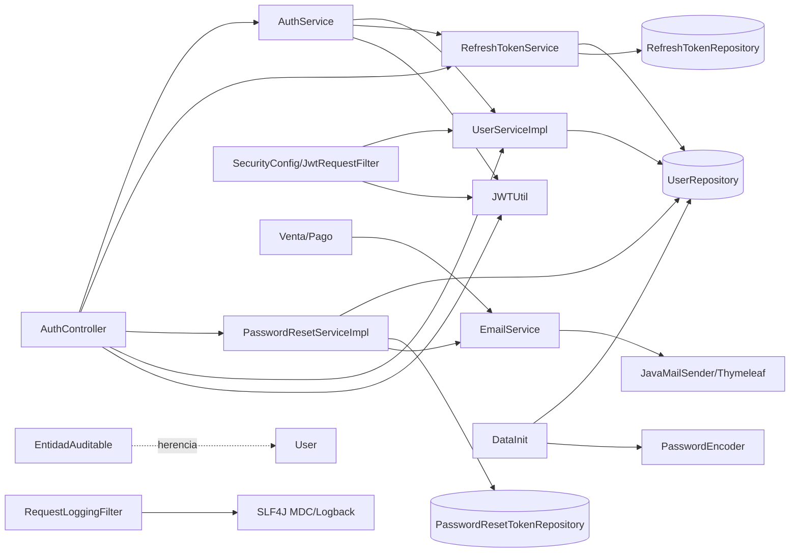

Límites recomendados: `usuario` es dueño de `User` y su repositorio; `auth` consume un puerto de usuario y posee credenciales/sesiones/tokens; `email` recibe comandos de envío sin importar entidades de rifa; `auditoria` no debe confundirse con timestamps ni logs; `shared` debe contener solo contratos realmente transversales.

## 5. Análisis de usuario

**Hechos.** `User` contiene `id`, `email`, `password`, `rol`, `createdAt`, `updatedAt`. No tiene nombre, apellido, `enabled`, verificación, bloqueo ni intentos fallidos. Implementa `UserDetails`; los defaults de esa interfaz dejan la cuenta habilitada/no expirada/no bloqueada mientras no se sobrescriban. `email` es único/no nulo en JPA. `rol` no declara `nullable=false`. No hay relaciones con entidades de rifa.

`getUsername()` devuelve email. Sin embargo, `UserRepository` declara `findByUsername` y `existsByUsername` aunque no existe atributo persistente `username`; esto es incoherente y puede impedir crear correctamente el repositorio según la resolución de propiedades de Spring Data. Las rutas activas usan principalmente `findByEmail`/`findByEmailIgnoreCase`.

No existe mapper separado. `UserDTO.fromUser()` declara `id`, `username`, `email`, `rol`, pero solo asigna `id`, `username` y `rol`; `email` queda nulo y `username` ya contiene el email. `AuthService.login()` construye el mismo DTO manualmente, duplicando el mapeo.

**Normalización.** Password reset usa `findByEmailIgnoreCase`; login y refresh usan `findByEmail`, sensible según collation/DB. No hay `trim`/lowercase antes de persistir o buscar. La unicidad case-insensitive depende accidentalmente de la collation MySQL y puede diferir en H2.

**Contratos públicos.** `POST /auth/login` y `GET /auth/profile` exponen `UserDTO`; el servicio ofrece CRUD (`deleteUser`, `updateUser`, `listAll`) aunque no se identificó controlador de usuario. Otros módulos auth acceden directamente a `UserRepository`: `RefreshTokenService`, `PasswordResetServiceImpl`, `DataInit` y `UserServiceImpl`.

**Evaluación del modelo orientativo.** `id`, `email`, password hasheado, creación y actualización son genéricos. Nombre/apellido, habilitación y verificación faltan y solo deben añadirse si el producto base los exige. No hay campos de rifa que deban descartarse. Conviene evitar que la entidad JPA sea simultáneamente el principal de seguridad, para reducir exposición y acoplamiento; no es imprescindible introducir una arquitectura compleja.

## 6. Análisis de roles y permisos

`Role` es enum: `SUPERADMINISTRADOR`, `ADMIN`, `USER`. Cada rol contiene un `Set<Permissions>`; `SUPERADMINISTRADOR` y `ADMIN` poseen exactamente `CREATED`, `READ`, `UPDATE`, `DELETE`; `USER`, `READ` y `CREATED`. `User` tiene un solo rol. No existen tablas de roles/permisos ni asociaciones N:M. `getAuthorities()` agrega `ROLE_<rol>` y permisos sin prefijo.

JWT solo incluye `sub`, `iat`, `exp`: roles/permisos no se cargan como claims. En cada request se lee el usuario desde DB y de allí sus authorities, lo cual actualiza permisos inmediatamente a costa de una consulta.

La autorización se reparte entre `SecurityConfig.requestMatchers()` y `@PreAuthorize`. Hay inconsistencias reales: `SorteoController` usa `SUPERADMIN`, inexistente; otros controladores usan `SUPERADMINISTRADOR`; varios usan solo `ADMIN`, excluyendo al supuesto superadmin. Los permisos CRUD no aparecen en `@PreAuthorize`; por tanto existen como authorities pero no se observó que gobiernen endpoints. El frontend recibe solo `rol` en login/profile, no permisos.

| Alternativa | Complejidad | Flexibilidad | Rendimiento/pruebas | Juicio para v1 |
|---|---|---|---|---|
| Enums | Baja | Requiere recompilar | Sin joins; determinista y simple de probar | Coherente si los roles son fijos; corregir nombres y permisos semánticos |
| Persistida (`UsuarioRol`, `RolPermiso`) | Alta | Alta, administración dinámica | Más tablas, caché/consultas, migraciones y pruebas de consistencia | Solo si un requisito real exige crear roles sin desplegar |

No hay evidencia que justifique persistir roles en la primera versión. Los permisos `CREATED/READ/...` son demasiado amplios para reutilización: deberían ser específicos por recurso o eliminarse hasta que haya autorización por permiso real.

## 7. Análisis de autenticación

| Función | Estado | Evidencia | Riesgo/observación |
|---|---|---|---|
| Login | Implementada con riesgos | `POST /auth/login`; `AuthController.login`; `AuthService.login` | Tokens en body/localStorage; sin rate limit ni estado de cuenta |
| Logout | No implementada | No hay endpoint | El frontend solo borra localStorage; refresh persistido sigue válido |
| Registro | No implementada | `RegisterRequest` huérfano | Opcional v1; DTO no coincide con `User` |
| Refresh | Implementada parcialmente | `POST /auth/refresh-token` | Rotación delete/create; secreto en log; errores genéricos; endpoint no está `permitAll` explícitamente |
| Verificación email | No implementada | Código comentado en `UserServiceImpl`; sin entidad/endpoint/template activo | Opcional o requisito a decidir |
| Forgot/reset | Implementada con riesgos | `POST /auth/forgot-password`, `GET/POST /auth/reset-password` | TTL inconsistente 30/50 min; no transaccional; no revoca sesiones |
| Cambio autenticado | No implementado | Solo reset por token | Requerido si starter gestiona cuenta |
| `/me` | Implementado como `/auth/profile` | `getUserProfile()` | DTO defectuoso; posible NPE defensiva si principal ausente fuera de chain |
| Bloqueo/habilitación | No implementado | Campos/métodos ausentes | Autenticación no puede suspender usuarios |
| Intentos fallidos | No implementado | Solo logs `LOGIN_FAILED` | Fuerza bruta sin control de aplicación |
| Bootstrap | Implementado pero acoplado/erróneo | `DataInit` + `app.init.*` | “superadmin” recibe `Role.ADMIN`; no transaccional; email no normalizado |
| Revocación | Parcial | `deleteByUser_Id` al crear/rotar | No logout, no password reset, no administración global |

`SecurityConfig` permite login, forgot/reset y `/auth/check`; este último no existe. No permite explícitamente `/auth/refresh-token`; cae en `.anyRequest().authenticated()`, lo cual obliga a presentar un access JWT válido para renovar. Eso impide renovar precisamente cuando el access token expiró y debe corregirse conceptualmente.

## 8. Cookies, JWT, CORS y CSRF

### Tokens y cookies

- Access JWT: header `Authorization`, HS256, `sub=email`, `iat`, `exp`; duración `app.security.jwt.access-expiration-minutes`.
- Refresh: UUID, tabla `Refresh Token`, en JSON request/response; duración usa `refresh-expiration-hours`. La propiedad `refresh-expiration-minutes` existe pero no se consume.
- No se crean cookies ni hay atributos `HttpOnly`, `Secure`, `SameSite`, `Path`, `Domain`, `Max-Age` o `Expires`.
- React almacena `accessToken` como `token` en `localStorage`; `apiClient.js` agrega Bearer. No usa `credentials: include`, porque el flujo actual no usa cookies. Tampoco se observó almacenamiento/uso del refresh.
- Logout React solo elimina `token`; no comunica revocación al backend.

`JWTUtil.getSignInKey()` decodifica el secreto como Base64. No hay `issuer`, `audience`, `jti`, versión de credenciales ni tolerancia de reloj. `JwtRequestFilter` distingue expirado y firma/formato, pero captura cualquier excepción (incluidos problemas DB) y responde 401. Su JSON usa `LocalDate` y campo `mensaje`, distinto de `ErrorResponse`.

### CORS/CSRF

`SecurityConfig.corsConfigurationSource()` toma `app.security.allowed-origins`, permite GET/POST/PATCH/PUT/DELETE/OPTIONS, headers `Authorization` y `Content-Type`, credenciales y expone `Authorization`. Los orígenes tienen defaults localhost. `enable-cors` existe en propiedades pero no condiciona la configuración. No se define `maxAge`.

`filterChain()` ejecuta `csrf.disable()`. Con Bearer obtenido explícitamente de `localStorage`, el navegador no adjunta credenciales automáticamente y CSRF no es el riesgo primario; XSS sí. Si el starter elige cookies, debe activar protección CSRF (por ejemplo token sincronizado/cookie CSRF legible por React), además de `HttpOnly` para tokens, `Secure` en producción, `SameSite` explícito y CORS exacto. `SameSite` reduce pero no elimina todos los escenarios CSRF. Con cookies cross-site React necesitaría `credentials: include`; con el flujo actual, no.

Docker publica frontend/backend en hosts/puertos distintos en desarrollo y usa nginx/frontend por separado; los orígenes de producción dependen del `.env`. El compose base contiene credenciales MySQL de desarrollo hardcodeadas; no deben trasladarse al starter.

## 9. Análisis de email

`EmailServiceImple` usa `JavaMailSender`, `TemplateEngine`, `@Value`, `MimeMessageHelper` y métodos `@Async`. Contiene mensajes simples, adjuntos, embebidos, password reset y cinco notificaciones de venta/comprobante. Sus dependencias incluyen directamente `Venta`, `Numero`, `MultipartFile`, `ComprobantePublicoService`, `VentaTokenService` y `NumeroFormatter`; por ello es código mixto.

La única plantilla genérica vigente es `password-reset-template.html`. Las demás (`comprobante-transferencia`, `comprobante-recibido-comprador`, `pago-confirmado-comprador`, `link-carga-comprobante`, `venta-cancelada-comprador`) son de rifa y no deben migrar. Los métodos antiguos usan `EMAIL_TEMPLATE="emailtemplate"`, pero ese recurso no aparece en el inventario: requieren investigación antes de considerarlos vivos.

Configuración: Spring Boot configura SMTP mediante `spring.mail.*`; `EmailServiceImple` lee `spring.mail.verify.host`, `spring.mail.username`, `app.mail.admin`, `app.frontend-url`. `AppProperties.Mail` intenta modelar `app.mail.host/port/username/password`, propiedades que no corresponden a las declaradas y no se observaron consumidas.

Los métodos capturan `Exception` y solo registran el error. El caller cree que el envío fue exitoso; no hay retry, outbox ni estado. Esto es especialmente relevante porque password reset persiste el token antes de enviar. `@Async` desacopla el error del caller, pero no se encontró `@EnableAsync`; debe verificarse en ejecución, no asumirse. Las escrituras SMTP son síncronas si `@Async` no está habilitado.

Para el starter tiene sentido separar un `EmailSender` de infraestructura, un renderizador de plantillas y casos directos como recuperación. `LogEmailSender` puede ser una implementación de desarrollo/test, no una obligación. Bienvenida, verificación y aviso de cambio solo deberían entrar si se eligen esos casos de uso.

## 10. Análisis de logs

`RequestLoggingFilter` registra entrada/salida, método, URI, IP, status y duración; genera un UUID truncado a 8 caracteres en MDC `requestId`, y `finally` limpia MDC. `FilterConfig` lo registra con máxima precedencia para `/*`. Confía directamente en `X-Forwarded-For`/`X-Real-IP`; solo debería hacerlo detrás de proxies confiables configurados.

`logback-spring.xml` escribe consola y `logs/app.log` (15 días/300 MB), `security.log` (30 días/300 MB) y `operations.log` (30 días/500 MB), con rolling por fecha/tamaño. Es escritura de archivo síncrona: bajo carga puede impactar latencia; no hay `AsyncAppender`. `OPERATIONS` existe como destino, pero no se encontró uso en el alcance.

`AuthController` duplica eventos en logger de clase y `SECURITY`. Registra email/IP/UA, datos personales que requieren política de retención. Más grave: registra prefijos de refresh y reset token. No se observaron contraseñas, JWT completos, cookies ni credenciales SMTP en logs. `GlobalExceptionHandler` usa `printStackTrace()`, fuera del formato y MDC habitual.

`LoggingAspect` está efectivamente inactivo porque intercepta `com.ecommerce.template.Service.Interface..*` y `.Controller..*`. Si se corrigiera indiscriminadamente, podría duplicar logs; actualmente no registra argumentos completos, solo cantidad. El `requestId` ya cubre correlación local; `correlationId` propagable sería útil entre servicios en el futuro, mientras `traceId` no se justifica en este monolito.

## 11. Análisis de auditoría

No existe auditoría persistida: no hay entidad, tabla, repositorio, servicio, aspecto/listener de cambios, actor, acción, IP, resultado, before/after ni metadata. `EntidadAuditable` solo aporta timestamps técnicos a entidades que heredan; no registra quién ni qué cambió. En `User`, produce `created_at` y `updated_at`.

Separación correcta de lo existente:

- Logs técnicos: `RequestLoggingFilter`, logger normal, errores.
- Eventos de seguridad: strings `LOGIN_*`, `TOKEN_REFRESH_*`, `PASSWORD_RESET_*` en `AuthController`; no persistidos ni estructurados.
- Auditoría de negocio: inexistente. Los logs de operaciones de rifa no equivalen a una bitácora consistente.

El starter no debería inventar auditoría de negocio sin definir retención, consulta, privacidad y consistencia. Puede reutilizar timestamps y definir un puerto opcional para eventos de seguridad; persistencia de auditoría es una capacidad separada.

## 12. Excepciones y respuestas HTTP

`GlobalExceptionHandler` maneja validación, not-found, método no permitido, credenciales, JWT, token de negocio, `BusinessException`, multipart y fallback. `ErrorResponse` contiene `LocalDate timestamp`, `HttpStatus status`, `mensaje`, `ruta`. No hay código estable, status numérico ni mapa de todos los campos inválidos: solo devuelve el primer error.

Inconsistencias: `InvalidTokenException` declara 401 por `@ResponseStatus`, pero el advice responde 400; JWT de firma custom responde 400, mientras el filtro responde 401; el filtro tiene otro JSON; respuestas exitosas de reset son texto plano; errores de autorización generados por Spring Security no pasan necesariamente por el advice. El fallback imprime stacktrace y devuelve mensaje genérico (no filtra por ambiente, aunque no expone el stack al cliente). El handler multipart hardcodea “5MB” sin propiedad correlativa visible.

Para React conviene un contrato único y estable con timestamp `Instant`, status numérico, `code`, mensaje, path y errores por campo. No se impone exactamente el record sugerido, pero el actual no es suficiente como contrato reusable.

## 13. Configuración

`AppProperties` (`@ConfigurationProperties(prefix="app")`) mezcla `Security`, `Mail`, `General`, `MercadoPagoProperties`, `Init`, `ReservaProperties` e incluso una clase `Images` no conectada. No se observan anotaciones de validación. `SecurityConfig` y email además usan `@Value`, fragmentando la configuración.

Propiedades relevantes:

| Grupo | Consumo/estado |
|---|---|
| `app.security.jwt.secret` | `JWTUtil`; sensible, Base64 |
| `access-expiration-minutes` | `JWTUtil`, `AuthService` |
| `refresh-expiration-hours` | `RefreshTokenService` |
| `refresh-expiration-minutes` | Declarada, no consumida |
| `allowed-origins` | `SecurityConfig` vía `@Value`; no modelada en `AppProperties.Security` |
| `enable-cors` | Modelada pero sin efecto |
| `spring.mail.*` | Auto-config y `EmailServiceImple`; password sensible |
| `spring.mail.verify.host` | Link de email; nombre confuso |
| `app.mail.admin` | Notificaciones de rifa |
| `app.frontend-url` | Reset y links de comprobante |
| `app.init.superadmin.*` | `DataInit`; password sensible |
| `app.init.seed-users.*` | `DataInit` |

Hay `application-test.properties` con H2 `create-drop` y secretos de prueba. Producción usa variables obligatorias y `ddl-auto=update`; no hay `application-dev/prod`. Existe `.env` local y dos nombres distintos esperados por compose (`.env`, `.env.backend`, `.env.db`); sus valores no fueron expuestos. No se encontró `.env.example`.

Conviene dividir propiedades por responsabilidad (`Security/Jwt`, `Cors`, `Email`, `Bootstrap`) y validarlas al arrancar. `CookieProperties` solo corresponde si se decide usar cookies; `OpenApiProperties`, cuando exista OpenAPI. No debe migrarse Mercado Pago/reserva/comprobante.

## 14. OpenAPI

No existe dependencia Springdoc/OpenAPI, configuración, Swagger UI, anotaciones, esquemas, ejemplos ni tests. Por tanto no hay nada reutilizable ni exposición accidental de Swagger. En el futuro deberían documentarse únicamente los endpoints efectivamente incluidos (login, refresh, logout si se implementa, perfil, recuperación, y registro/verificación si se eligen), junto con el contrato común de error.

Con el esquema actual se documentaría `http` bearer JWT. Si se eligen cookies, OpenAPI 3 permite `apiKey` en `cookie` para cada cookie relevante, aclarando el mecanismo CSRF por separado; Swagger UI requerirá configuración acorde al origen/credenciales. La activación por ambiente es una decisión pendiente.

## 15. Patrones

| Patrón | Clases/problema | Evaluación |
|---|---|---|
| Repository | Repositorios JPA | Mantener; simple y testeable. Evitar acceso transversal directo mediante contratos de módulo |
| Service/Application service | `AuthService`, `PasswordResetServiceImpl` | Mantener concepto; corregir límites y transacciones |
| Mapper | `UserDTO.fromUser`, mapeo manual en `AuthService` | Hoy duplicado; un mapper explícito simple basta, sin framework obligatorio |
| Adapter/port | `EmailService` pretendía abstraer envío | Dividir interfaz de transporte de casos de negocio; no crear interfaces para cada clase |
| Filter chain | filtros Spring Security/logging | Apropiado; unificar respuestas y orden |
| Observer/asíncrono | `@Async` email | No es un observer real; llamada directa es suficiente en v1, con error observable |
| AOP | `LoggingAspect` | Eliminar o corregir solo si aporta algo no cubierto por filtro; hoy inactivo |
| Facade accidental | `AuthController` | Demasiadas responsabilidades; separar controladores/casos sin arquitectura hexagonal completa |

No se detectaron dependencias circulares de constructor dentro del alcance. Sí hay acoplamiento bidireccional conceptual: auth conoce email y usuario; email conoce entidades/casos de rifa. Los límites de paquete actuales no impiden accesos directos.

## 16. Preparación conceptual para microservicios

| Módulo | Estado y dependencias | Dificultad/riesgo de extracción |
|---|---|---|
| usuario | Dueño natural de `usuarios`; auth y bootstrap usan repo directo | Media. Separar principal de entidad y exponer búsqueda/estado; consistencia auth-usuario sería crítica |
| auth | Usa usuario, repositorios de tokens, email, Spring Security | Alta. Login requiere credenciales/estado; transacciones de refresh/reset cruzan datos |
| email | SMTP externo, plantillas; hoy importa `Venta`, `Numero` y servicios de venta | Alta hasta aceptar comandos neutrales; luego media. Entrega asíncrona introduce consistencia eventual |
| auditoría | No existe | No evaluable. Diseñar datos/retención antes de extraer |

Ningún módulo está listo para microservicios. Antes se requieren propiedad de datos, contratos internos, eliminación del acceso directo a repositorios ajenos, idempotencia y decisiones de consistencia. No se justifica incorporar infraestructura distribuida ahora.

## 17. Base de datos

| Tabla efectiva/esperada | Entidad | Restricciones observadas | Migración | Acción para starter |
|---|---|---|---|---|
| `usuarios` | `User` | PK identity; email unique/not-null; password not-null; rol enum string; timestamps | Ninguna | Migración versionada; normalización/índice case-insensitive según DB; estados según decisión |
| `Refresh Token` | `RefreshToken` | PK identity; token/expiry sin constraints explícitas; FK `user_id`; N:1 | Ninguna | Renombrar `refresh_tokens`; unique hash; expiry/index; estrategia multi/sesión única |
| nombre implícito de `PasswordResetToken` | `PasswordResetToken` | PK; token/expiration/used sin constraints; one-to-one user | Ninguna | Nombre explícito, hash unique, FK/índices/created/used-at, limpieza |
| roles/permisos | enums | Sin tablas | No aplica | No crear tablas salvo requisito dinámico |
| verificación | No existe | — | — | Solo crear si se incluye verificación |
| auditoría | No existe | — | — | No inventar hasta definir alcance |

No hay Flyway/Liquibase. Los SQL bajo `src/main/resources/db/manual` son migraciones manuales exclusivas de venta/talonarios y no gobiernan este alcance. Producción usa Hibernate `ddl-auto=update`; test, `create-drop`. `DataInit` crea usuarios desde variables/JSON al iniciar. Para un starter reusable, el esquema debe ser explícito y versionado; los datos de rifa y `seed_users.json` no deben migrar como defaults.

## 18. Tests

Herramientas: JUnit 5, Mockito, Spring Boot Test, Spring Security Test, MockMvc, H2 y AssertJ (transitivo). No se encontró Testcontainers. Existe perfil `test` adecuado para H2, aunque H2/MySQL puede ocultar diferencias de collation, nombres e índices.

Cobertura relevante confirmada:

- `AuthServiceTest`: login exitoso/fallido, DTO y expiración.
- `AuthControllerIntegrationTest`: 4 escenarios de login con MockMvc.
- `JwtUtilTest`: 7 escenarios de generación/extracción/validez/token inválido.
- `PasswordResetServiceImplTest`: 11 escenarios, incluido hash, expirado/usado y cambio.
- `PasswordResetRequestIntegrationTest`: 4 escenarios de solicitud/persistencia.
- `ResetPasswordIntegrationTest`: 5 escenarios de consumo.
- `EmailServiceImpleTest`: 4 pruebas, concentradas en notificaciones de rifa, no en reset SMTP completo.
- `RifaApplicationTests`: carga contexto. Los reportes Surefire existentes de todo el proyecto muestran 0 fallos/errores, pero son artefactos previos, no una ejecución realizada durante este análisis.

Faltantes críticos: `RefreshTokenService`/endpoint (rotación, concurrencia, expiración, endpoint con access expirado), logout/revocación, `/auth/profile`, normalización/unicidad email, bootstrap, cuenta bloqueada, roles y cada variante de `@PreAuthorize`, `JwtRequestFilter` y sus errores, CORS/preflight/CSRF, logs/MDC, `GlobalExceptionHandler`, auditoría, cookies (si se eligen), OpenAPI (no existe) y prueba contra MySQL real. `AuthControllerIntegrationTest` declara orden de métodos, señal de dependencia potencial aunque sus casos deben evaluarse individualmente; las integraciones modifican H2 compartida dentro del contexto y suelen limpiar en setup.

Pruebas reutilizables conceptualmente: login, JWT y password reset. Las de `EmailServiceImpleTest` con `Venta`/comprobantes son específicas de rifa y no pertenecen al starter.

## 19. Diagramas Mermaid

### Login actual

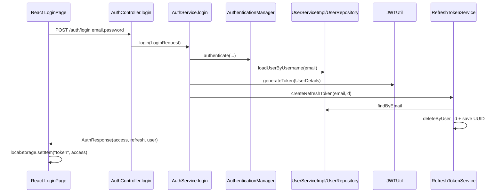

### Refresh actual

```mermaid
sequenceDiagram
  participant C as AuthController.refreshToken
  participant S as RefreshTokenService
  participant J as JWTUtil
  C->>S: findByToken(token)
  S-->>C: RefreshToken
  C->>S: verifyExpiration
  C->>S: delete(userId)
  C->>J: generateToken(user)
  C->>S: createRefreshToken(email,id)
  S->>S: vuelve a borrar y guarda UUID
  C-->>C: TokenRefreshResponse
  Note over C: Endpoint no está permitAll; access expirado puede impedir llegar aquí
```

### Logout actual

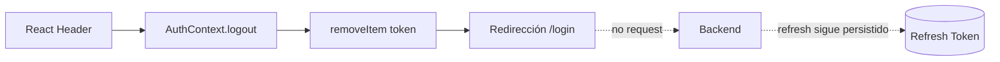

### Registro actual


### Verificación de correo actual

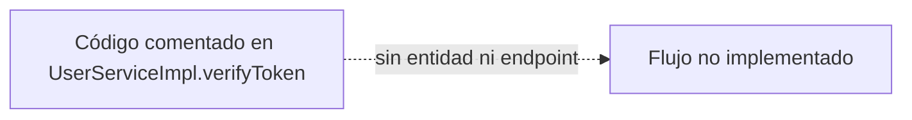

### Recuperación/restablecimiento

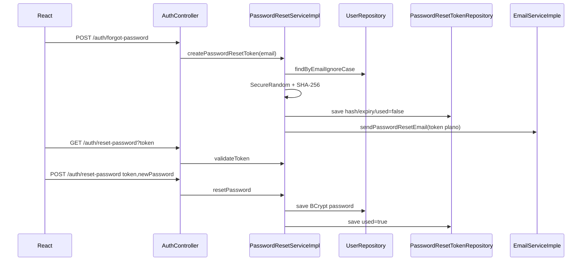

### HTTP normal

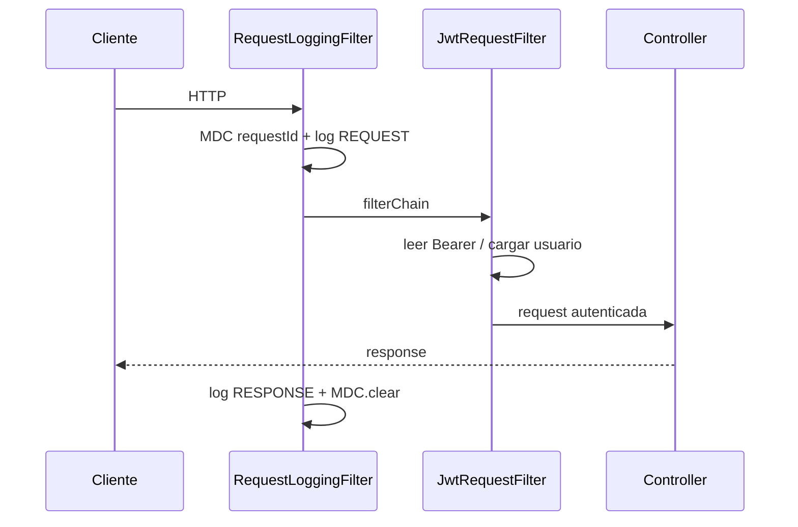

### HTTP con excepción

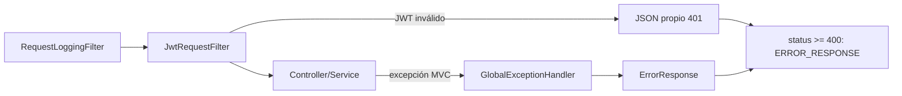

### Logs

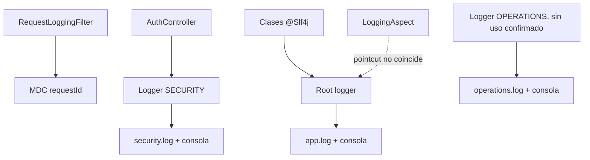

### Auditoría actual

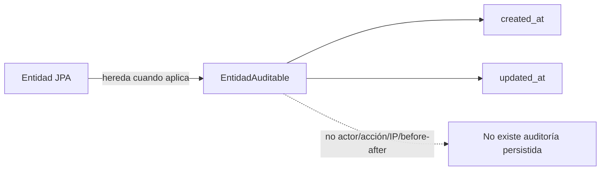

### Envío de email

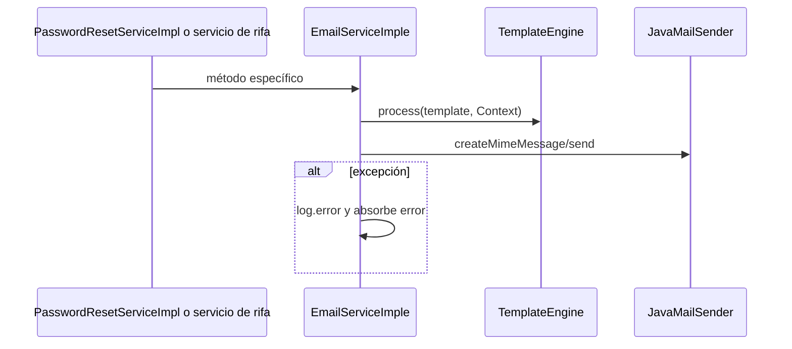

### Perfil (`/me` equivalente)

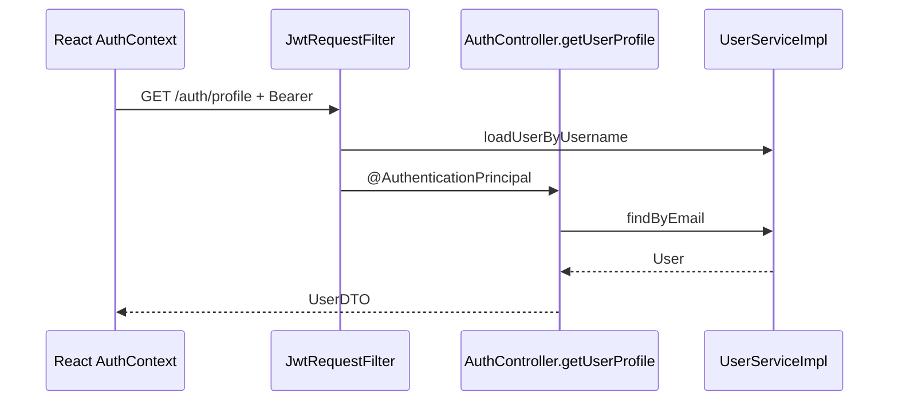

## 20. Hallazgos priorizados

| Prioridad | Hallazgo | Riesgo | Recomendación | Complejidad |
|---|---|---|---|---|
| Crítica | Refresh endpoint exige autenticación por regla general | Access vencido bloquea renovación | Definir y probar regla específica y validación propia del refresh | Baja |
| Crítica | Secretos parciales en logs | Facilita correlación/abuso y filtra credenciales | No registrar tokens ni fragmentos | Baja |
| Alta | Sin logout/revocación tras reset | Sesiones comprometidas sobreviven | Diseñar revocación/versión de sesión | Media |
| Alta | Tokens en body + access en localStorage | XSS roba token | Elegir explícitamente Bearer vs cookies y modelo de amenazas | Media/Alta |
| Alta | CSRF desactivado como configuración copiable | Grave si luego se usan cookies | Estrategia condicional coherente; cookies implican CSRF | Media |
| Alta | Password reset no transaccional | Password cambia sin consumir token o viceversa | Operación atómica y revocación de sesiones | Baja |
| Alta | Roles inconsistentes y bootstrap crea ADMIN | Autorización incorrecta | Unificar vocabulario y probar matriz | Baja |
| Alta | Sin migraciones; `ddl-auto=update` | Esquema no reproducible/seguro | Migraciones versionadas antes del starter | Media |
| Alta | Entidades de token sin constraints/refresh en claro | Duplicados y robo desde DB | Hash, unique, índices, nombre de tabla y lifecycle | Media |
| Media | Email monolítico absorbe errores | Acoplamiento y falsa entrega | Separar sender/render/casos; política de error | Media |
| Media | Perfil/DTO inconsistente | Contrato frontend defectuoso | Mapper único y DTO mínimo | Baja |
| Media | Email no normalizado | Duplicados/login inconsistente | Política única de canonicalización | Baja |
| Media | Errores HTTP divergentes | Cliente debe manejar múltiples formas | Contrato y entry points de seguridad comunes | Media |
| Media | Logs AOP inactivos/duplicados | Falsa observabilidad | Eliminar o corregir con alcance claro | Baja |
| Media | Auditoría inexistente | No trazabilidad de cambios sensibles | Definir primero requisitos; separar de logs | Media/Alta |
| Media | Configuración gigante y no validada | Fallos tardíos/mala portabilidad | Propiedades tipadas por módulo | Media |
| Baja | OpenAPI inexistente | Contrato manual | Incorporar solo después de estabilizar API | Baja/Media |

## 21. Decisiones pendientes

Estas decisiones no pueden resolverse solo inspeccionando el código:

1. ¿El starter será una aplicación base clonable o un verdadero auto-configuring Spring Boot Starter consumible como dependencia? `StarterApplication.java` sugiere lo primero, el nombre “starter” puede sugerir lo segundo.
2. ¿Bearer en memoria/localStorage o access/refresh en cookies HttpOnly? Esto determina CSRF, CORS y contratos.
3. ¿Se admite una sola sesión por usuario o múltiples dispositivos/sesiones revocables individualmente?
4. ¿Registro será público, administrativo u opcional? ¿Email verificado será requisito para autenticar?
5. ¿Nombre/apellido son obligatorios o el usuario mínimo se identifica solo por email?
6. ¿Roles son fijos por código o existe requisito real de roles dinámicos sin despliegue?
7. ¿Qué eventos requieren auditoría persistida, cuánto se retienen y quién puede consultarlos?
8. ¿Fallo de email debe revertir el caso de uso, quedar reintentable o solo notificarse?
9. ¿Qué bases de datos y versiones debe soportar oficialmente el starter?
10. ¿Swagger/OpenAPI estará habilitado en producción o solo en perfiles internos?

## 22. Recomendación final

Conviene **crear la base nueva desde cero usando este proyecto como referencia**, no extraer el árbol actual literalmente. La organización por capas técnicas, el acoplamiento de email, la configuración mixta y las inconsistencias de seguridad harían más costosa una migración mecánica que una implementación limpia y pequeña.

Se puede reutilizar o adaptar: comportamiento y pruebas de login/JWT/reset; `LoginRequest`, `ForgotPasswordRequest`, el principio de `EntidadAuditable`, BCrypt, el hash de tokens de recuperación, `RequestLoggingFilter`/MDC y la configuración Logback como punto de partida.

Se debe reescribir: modelo/almacenamiento y lifecycle de refresh tokens; DTO/mapper de usuario; configuración y respuestas de seguridad; bootstrap; límites de email; propiedades tipadas; contrato de errores. No deben migrarse `ComprobanteLinkService*`, métodos/plantillas de ventas, Mercado Pago, reserva, utilidades de números ni seeds propios de rifa.

La primera base debería conservar una arquitectura modular pragmática: paquetes por capacidad y dependencias explícitas, sin imponer todas las subcapas sugeridas, sin interfaces triviales y sin microservicios. La estructura definitiva depende de las diez decisiones anteriores; el código actual permite resolver el resto de los hallazgos sin más investigación funcional.
